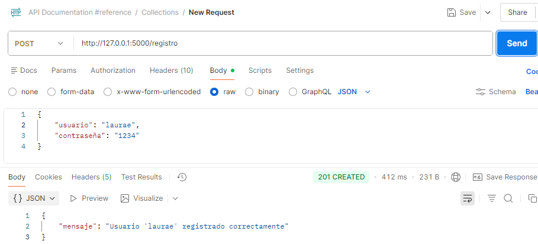
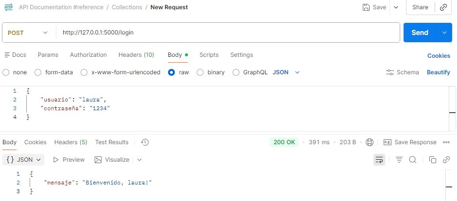
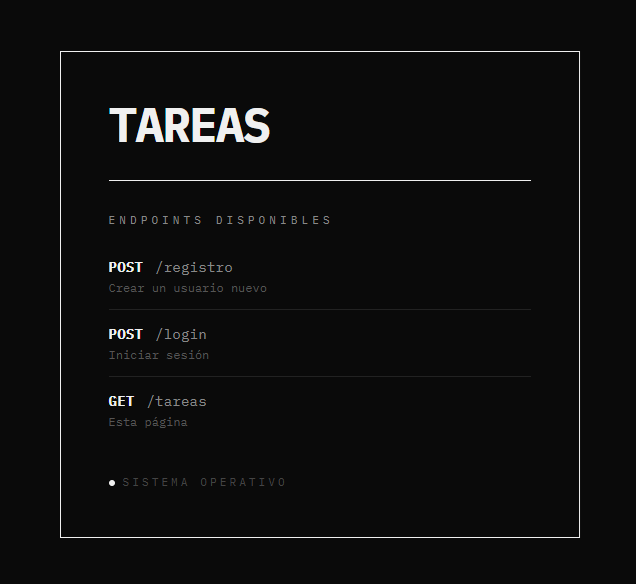
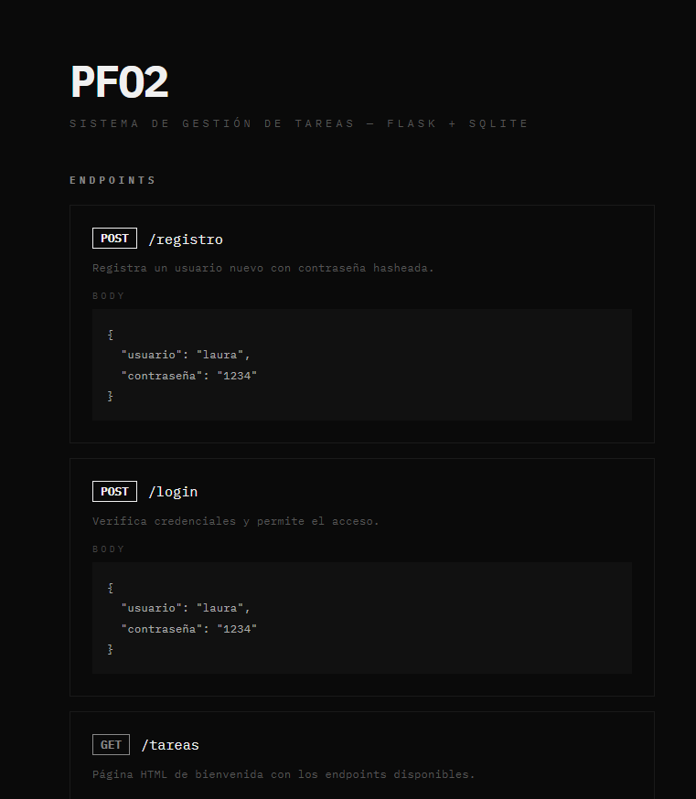

# PFO 2 - Sistema de Gestión de Tareas

API REST desarrollada con Flask y SQLite.

## Requisitos

- Python 3.13
- pip

## Instalación

1. Clonar el repositorio
2. Crear el entorno virtual:
   python -m venv venv
3. Activarlo:
   venv\Scripts\activate
4. Instalar dependencias:
   pip install flask bcrypt

## Ejecución

python servidor.py

El servidor corre en http://127.0.0.1:5000

## Endpoints

### POST /registro
Registra un usuario nuevo.

Body:
{
    "usuario": "nombre",
    "contraseña": "1234"
}

Respuesta exitosa (201):
{
    "mensaje": "Usuario 'nombre' registrado correctamente"
}

### POST /login
Inicia sesión con un usuario existente.

Body:
{
    "usuario": "nombre",
    "contraseña": "1234"
}

Respuesta exitosa (200):
{
    "mensaje": "Bienvenido, nombre!"
}

### GET /tareas
Muestra una página HTML de bienvenida con los endpoints disponibles.
Abrir en el navegador: http://127.0.0.1:5000/tareas

## Respuestas Conceptuales

### hashear contraseñas
Hashear contraseñas es fundamental por seguridad. Si la base de datos
es comprometida, el atacante no obtiene las contraseñas reales sino
valores irreversibles. Se usa bcrypt porque aplica un "salt" aleatorio
y es computacionalmente costoso, dificultando ataques de fuerza bruta.
Nunca se deben guardar contraseñas en texto plano.

### Ventajas de usar SQLite en este proyecto
- No requiere instalar un servidor de base de datos separado.
- El archivo .db se crea automáticamente al ejecutar el proyecto.
- Es suficiente para proyectos pequeños y de desarrollo.
- Viene incluido en Python, sin dependencias extra.
- Fácil de transportar: toda la base de datos es un solo archivo.

## Capturas de pantalla

### Registro exitoso

### Login exitoso

### Página de tareas

### GitHub Pages
